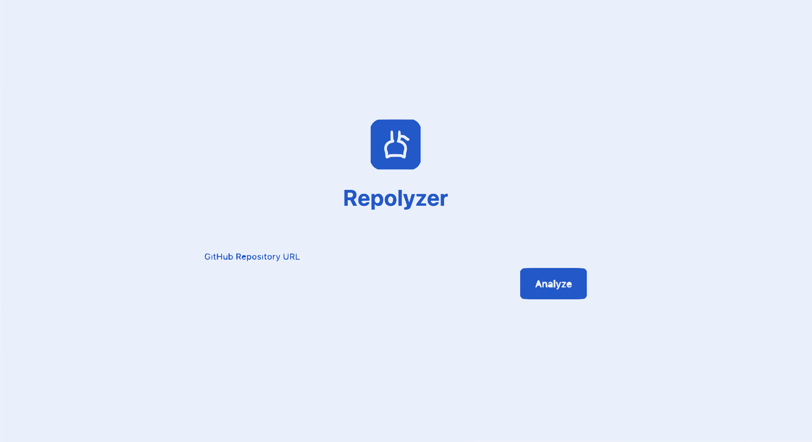

# Repo Chat Assistant

AI-powered chat interface to explore and understand any GitHub repository.



## 🚀 Live Demo

[Deploy this app to see the live demo]

## ✨ Features

- **Paste any GitHub repository URL** - Support for any public GitHub repository
- **Fast intelligent indexing** - Quickly analyzes repository structure and key files
- **Natural language Q&A** - Ask questions about the codebase in plain English
- **Syntax-highlighted code snippets** - Beautiful code formatting in responses
- **Repository structure visualization** - Interactive file tree with collapsible folders
- **Dark/light mode** - Seamless theme switching for comfortable viewing
- **Streaming AI responses** - Real-time token-by-token response generation
- **Smart context management** - Efficient handling of large repositories

## 🛠 Tech Stack

- **React** - UI library
- **TypeScript** - Type-safe development
- **Tailwind CSS** - Utility-first styling
- **Vite** - Fast build tool
- **GitHub API** - Repository data fetching
- **OpenAI API / Anthropic Claude API** - AI-powered responses
- **Lucide React** - Beautiful icons

## 📋 Prerequisites

Before running this application, you'll need:

1. **GitHub Personal Access Token** (optional, but recommended for higher rate limits)
   - Go to [GitHub Settings → Developer Settings → Personal Access Tokens](https://github.com/settings/tokens)
   - Generate a new token with `public_repo` scope
   - Copy the token for use in environment variables

2. **AI API Key** (required - choose one)
   - **OpenAI API Key**: Get from [OpenAI Platform](https://platform.openai.com/api-keys)
   - **Anthropic API Key**: Get from [Anthropic Console](https://console.anthropic.com/)

## 🔧 Setup

1. **Clone the repository**
   ```bash
   git clone https://github.com/yourusername/repo-chat-assistant.git
   cd repo-chat-assistant
   ```

2. **Install dependencies**
   ```bash
   npm install
   ```

3. **Configure environment variables**

   Create a `.env` file in the root directory:
   ```env
   # GitHub API (optional - increases rate limits)
   VITE_GITHUB_TOKEN=your_github_token_here

   # AI API (choose one)
   VITE_OPENAI_API_KEY=your_openai_api_key_here
   # OR
   VITE_ANTHROPIC_API_KEY=your_anthropic_api_key_here
   ```

4. **Run the development server**
   ```bash
   npm run dev
   ```

5. **Open your browser**

   Navigate to `http://localhost:5173`

## 💡 Usage

1. **Enter a repository URL**
   - Paste a full GitHub URL: `https://github.com/facebook/react`
   - Or use shorthand: `facebook/react`
   - Or click one of the example repositories

2. **Wait for indexing**
   - The app will fetch repository metadata
   - Analyze the file structure
   - Parse key configuration files
   - Build context for AI understanding

3. **Ask questions**
   - Type your question in natural language
   - Click suggested prompts for inspiration
   - Get intelligent answers with code examples

4. **Explore the repository**
   - Browse the file tree in the left panel
   - View repository statistics
   - Collapse/expand the sidebar as needed

## 🎯 Example Questions

Try asking these questions about any repository:

- "What does this project do?"
- "Explain the main architecture and how components are organized"
- "Show me where authentication is handled"
- "What are the key dependencies and why are they used?"
- "How does the routing work in this application?"
- "Explain the build process and configuration"
- "What testing framework is used and where are the tests?"
- "Show me the main entry point and explain the initialization flow"

## 🔐 API Rate Limits

- **GitHub API without token**: 60 requests/hour
- **GitHub API with token**: 5,000 requests/hour
- **OpenAI API**: Varies by plan (see [OpenAI pricing](https://openai.com/pricing))
- **Anthropic API**: Varies by plan (see [Anthropic pricing](https://www.anthropic.com/pricing))

## 🏗️ Project Structure

```
repo-chat-assistant/
├── src/
│   ├── components/          # React components
│   │   ├── Header.tsx       # Top navigation bar
│   │   ├── RepositoryInput.tsx   # URL input screen
│   │   ├── LoadingScreen.tsx     # Indexing progress
│   │   ├── RepositoryPanel.tsx   # Left sidebar with file tree
│   │   ├── FileTree.tsx          # Interactive file browser
│   │   ├── ChatInterface.tsx     # Chat UI
│   │   └── ChatMessage.tsx       # Individual messages
│   ├── services/           # External service integrations
│   │   ├── github.ts       # GitHub API calls
│   │   └── ai.ts           # AI API integration
│   ├── types/              # TypeScript type definitions
│   │   └── index.ts
│   ├── App.tsx             # Main application component
│   ├── main.tsx            # Application entry point
│   └── index.css           # Global styles
├── public/                 # Static assets
│   └── og-image.svg        # Social sharing preview
├── index.html              # HTML template with meta tags
├── package.json            # Dependencies and scripts
├── vite.config.ts          # Vite configuration
├── tailwind.config.js      # Tailwind CSS configuration
└── tsconfig.json           # TypeScript configuration
```

## 🤝 Contributing

Contributions are welcome! Please feel free to submit a Pull Request.

1. Fork the repository
2. Create your feature branch (`git checkout -b feature/AmazingFeature`)
3. Commit your changes (`git commit -m 'Add some AmazingFeature'`)
4. Push to the branch (`git push origin feature/AmazingFeature`)
5. Open a Pull Request

## 📝 License

This project is licensed under the MIT License - see the [LICENSE](LICENSE) file for details.

## 🙏 Acknowledgments

- Built with [React](https://react.dev/)
- Styled with [Tailwind CSS](https://tailwindcss.com/)
- Icons from [Lucide](https://lucide.dev/)
- Powered by [GitHub API](https://docs.github.com/en/rest)
- AI capabilities from [OpenAI](https://openai.com/) and [Anthropic](https://www.anthropic.com/)

## 📞 Support

If you encounter any issues or have questions:

1. Check the [Issues](https://github.com/yourusername/repo-chat-assistant/issues) page
2. Create a new issue with detailed information
3. Include error messages and steps to reproduce

---

Made with ❤️ for developers who want to understand code better
